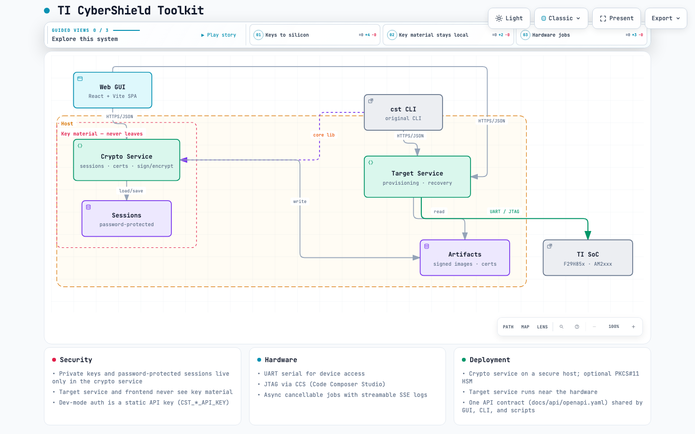

# TI CyberShield Toolkit

Secure provisioning toolkit for TI EP SoCs (F29H85x and AM2xxx families). The
toolkit provides key generation, certificate creation, image signing/encryption,
and target provisioning over UART/JTAG.

> Before working with hardware, read the [F29H85x setup guide](README_FIRST_F29H85X_TICST.html) for
> setup instructions and an overview of the F29H85x CyberShield Toolkit.

## Architecture

The tool is split into two HTTP services plus a browser frontend, so any client
(GUI, CLI, scripts) uses the same API:

```
┌──────────────────────────────┐
│  Web GUI (React, in browser) │
└───────┬──────────────┬───────┘
        │ HTTPS/JSON   │ HTTPS/JSON
        ▼              ▼
┌─────────────────┐ ┌────────────────────┐
│ Backend #1      │ │ Backend #2         │
│ crypto service  │ │ target service     │
│ · sessions/keys │ │ · SoC ID, device   │
│ · certificates  │ │   type detection   │
│ · image sign/   │ │ · key/code         │
│   encrypt       │ │   provisioning     │
│ · SoC ID parse  │ │ · device recovery  │
│ · artifacts     │ │ · binary download  │
└─────────────────┘ └────────────────────┘
        Private keys      UART + JTAG (CCS) only;
        live here only    no key material
```

- **Backend #1 (`services.crypto`)** – holds all sensitive key material
  (password-protected sessions). Private keys never leave this service.
- **Backend #2 (`services.target`)** – all hardware access over serial (UART)
  and CCS (JTAG). Exposed as cancellable async jobs with streamable logs.
- **Web GUI (`frontend/`)** – React + Vite SPA that talks to both services
  through a single origin.
- **CLI (`cst`)** – the original command-line interface still works against the
  same core library.

The machine-readable API contract lives in `docs/api/openapi.yaml`, with the
design rationale in `docs/api/ARCHITECTURE.md`.

### Architecture map



An interactive version (focus nodes, trace routes, guided views, dark/light
themes) is in [`tisecprov.architecture.html`](tisecprov.architecture.html) —
open it locally in a browser, or via GitHub Pages once enabled. See
[`ARCHITECTURE_MAP.md`](ARCHITECTURE_MAP.md) for details.

## Pros and Cons

| Aspect | Pros | Cons |
| --- | --- | --- |
| **Client surface** | One API contract (`docs/api/openapi.yaml`) used by the GUI, CLI and scripts — no logic is forked. | Three processes to run (crypto + target + web) instead of a single-binary CLI. |
| **Security** | Private keys and password-protected sessions live only in the crypto service; the target service and frontend never see key material. | Dev-mode auth is a static API key (only enforced when `CST_*_API_KEY` is set); TLS is expected to be terminated by an upstream gateway. |
| **Deployment** | The crypto service can run on a secure host (ideally with the HSM attached) while the target service sits near the hardware (serial / CCS). | Requires two toolchains: Python for the services, Node.js for the web GUI. |
| **Long-running operations** | Hardware ops are async, cancellable jobs with streamable logs (SSE) — provisioning doesn't block the UI. | The job manager is in-memory: jobs are lost on service restart (no history/persistence). |
| **Session handling** | Sessions are password-protected and stored on disk; public keys are exportable. | Session tokens are in-memory and expire after 30 minutes. |
| **Concurrency** | — | Jobs that capture stdout are serialized by a global lock (one provisioning at a time). |
| **Extensibility** | New devices plug in via addons and the registry without changing the API surface. | Hardware ops still shell out to existing CCS/UART tools (a pre-existing core limitation). |
| **Backward compatibility** | The original `cst` CLI keeps working against the same core library. | The web GUI is a crypto workbench — target provisioning screens are not wired in yet. |

## Requirements

- Python 3.10+ (with `pip`)
- Node.js 18+ (for the web GUI)
- Optional: PKCS#11 HSM smartcard (`[hsm]` extra), Code Composer Studio (for
  JTAG operations)

## Installation

### Services (Python)

```bash
cd host
python3 -m venv venv
./venv/bin/pip install -e .[server]
```

Other optional extras: `hsm` (PKCS#11), `gui` (legacy PyQt wizard), `dev`
(testing/lint). After installing you get the `cst`, `cst-crypto` and
`cst-target` commands.

### Web GUI

```bash
cd frontend
npm install
```

## Running

### One command (recommended)

```bash
./run_dev.sh
```

This starts all three pieces with persistent storage:

| Component          | URL                          |
| ------------------ | ---------------------------- |
| crypto service     | http://127.0.0.1:8000        |
| target service     | http://127.0.0.1:8001        |
| web GUI            | http://localhost:5173        |

Sessions are stored under `~/.local/share/tisecprov/sessions` and artifacts
under `~/.cache/tisecprov/artifacts`, so they survive restarts. Ctrl-C stops
everything.

### Manually

```bash
# terminal 1 – crypto service
cd host
TISECPROV_SESSION_DIR="$HOME/.local/share/tisecprov/sessions" \
CST_ARTIFACT_DIR="$HOME/.cache/tisecprov/artifacts" \
./venv/bin/python -m services.crypto

# terminal 2 – target service (only needed for hardware operations)
cd host
TISECPROV_SESSION_DIR="$HOME/.local/share/tisecprov/sessions" \
CST_ARTIFACT_DIR="$HOME/.cache/tisecprov/artifacts" \
./venv/bin/python -m services.target

# terminal 3 – web GUI
cd frontend
npm run dev
```

> Use the **same** `TISECPROV_SESSION_DIR` every time – sessions live there, and
> a different directory makes existing sessions appear to disappear.

## Using the web GUI

Open http://localhost:5173. The header shows whether the crypto service is
reachable (click the pill to re-check).

1. **Sessions** – create a session (choose SMPK/BMPK signing algorithms, e.g.
   `rsa4k`/`secp256r1`). Generating a session also opens it, so it becomes the
   active session. Re-open existing sessions from the row's **Open** button or
   the open form. Export public keys for download.
2. **Certificates** – upload the TI FEK public key (`.pem`), then generate the
   OTP key certificate (silicon revision, MSV, software revisions, key slots,
   protection flags, extended OTP). Also available: ROT switching, debug and
   device recovery certificates.
3. **Images** – upload a binary, then sign it (`signapp`), sign a security
   configuration (`sign-seccfg`, needs a CCS path), or encrypt it. **Start batch
   sign** signs the prebuilt binary set as an async job.
4. **Artifacts** – upload files and download anything generated (certificates,
   signed images, headers).
5. **Jobs** – browse async jobs, open one to watch live logs (SSE) and cancel it.

If the services were started with `CST_CRYPTO_API_KEY`/`CST_TARGET_API_KEY`,
enter the same key in the **API key** box in the header.

## Command-line interface

The CLI is unchanged and documented in the [host README](host/README.md) and the
[F29H85x CLI reference](host/CLI_F29H85x_DOC.md).

```bash
cd host
./venv/bin/cst --device f29h85x genkeys -s Session1 -p test123 \
    --smpk_signing_algorithm rsa4k --bmpk_signing_algorithm secp384r1
```

## Troubleshooting

| Symptom | Fix |
| --- | --- |
| `ECONNREFUSED` errors in the Vite terminal | The services aren't running – start them (see **Running**) |
| "crypto down" in the GUI header | Click the pill to re-check, or start the crypto service |
| Sessions appear to vanish | Keep the same `TISECPROV_SESSION_DIR` across runs |
| `401 Unauthorized` on every request | The services require an API key (`CST_*_API_KEY`); set it in the GUI header or restart without the env var |
| `Request validation failed` | Hard-refresh the browser, then retry; the error now names the failing field |

## Development

- Run tests: `cd host && ./venv/bin/python -m pytest tests/ -q`
- The service tests cover the crypto service, the target service and the job
  manager; the web GUI type-checks with `cd frontend && npm run build`.
- See the design document in `docs/api/ARCHITECTURE.md` for the split between
  the two backends and the roadmap (React frontend, job streaming, etc.).

## License

This project is licensed under the terms in [license.txt](license.txt).
Additional TI addons (device binaries and TI FEK keys) are distributed
out-of-band alongside the TIFS SDK on [ti.com](https://www.ti.com).